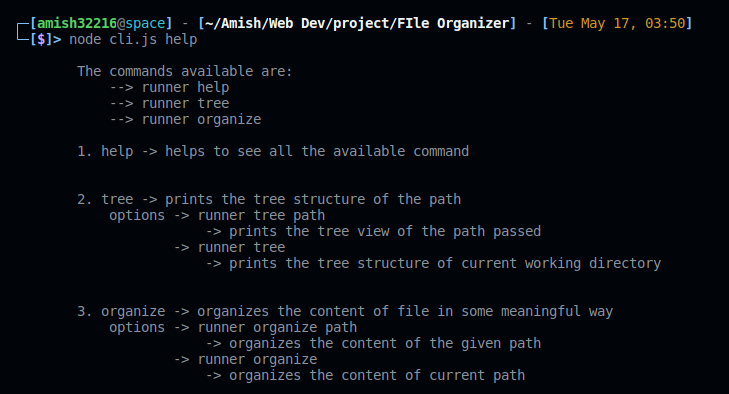
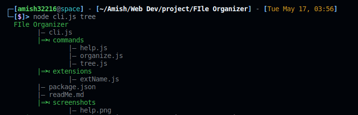
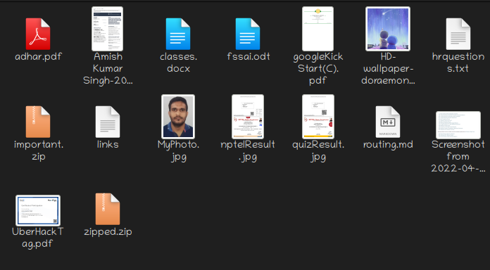
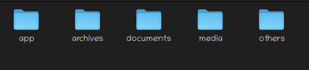

# File Organizer organizes the file in proper manner based on extension of the file and put them in appropriate folder

# commands
<!-- Help -> execute -> node cli.js help -->
    <!-- It will list all the commands available in this feature -->

    

        
    

<!-- Tree -> execute -> node cli.js tree -->
    <!-- It will print the tree structure of a given folder -->

    

        
    

<!-- organize -> execute -> node cli.js organize -->
    <!-- oranizes the file in a structured way -->

    

        
    

    

        
    
